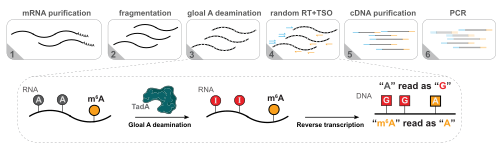

[](https://hub.docker.com/r/y9ch/etamseq)

# m<sup>6</sup>A-eTAM-seq



## Qucik start (Run in docker environment)

- Prepare configuration file (`data.yaml` for example)

minimum configuration example:

```yaml
genome_index: ~/reference/genome/Homo_sapiens/hisat2_tx_3n/GRCh38.release110

reference:
  contamination:
    - test/ref/contamination.fa.gz
  genes:
    - test/ref/spikein.fa
    - test/ref/human_rRNA.fa
  genome:
    - ~/reference/genome/Homo_sapiens/GRCh38.fa

samples:
  HeLa-treat-rep1:
    data:
      - R1: test/data/SRR21070405_1.fastq.gz
        R2: test/data/SRR21070405_2.fastq.gz
      - R1: test/data/SRR21070406_1.fastq.gz
  HeLa-treat-rep2:
    data:
      - R1: test/data/SRR21070404_1.fastq.gz
```

advanced configuration:

_Refer to documentation at [https://y9c.github.io/m6A-eTAMseq/](https://y9c.github.io/m6A-eTAMseq/)_

- Install apptainer and run

  ```bash
  apptainer run docker://y9ch/etamseq -c data.yaml -j 48
  ```

- Note: On server without external internet access, you can use the following command to pull the docker image first:

  ```bash
  apptainer build etamseq.sif docker://y9ch/etamseq
  apptainer run etamseq.sif -c data.yaml -j 48
  ```

- Note: If your sequencing data for reference files are under a mounted directory, you may need to add `--bind /path/to/mounted/dir` to the apptainer command line.

  ```bash
  apptainer run --bind /path/to/mounted/dir docker://y9ch/etamseq -c data.yaml -j 48
  ```

## Local environment and customization

- If you want to test the code under local environment, you can clone the repository by the following command:

  ```bash
  git clone --recurse-submodules https://github.com/y9c/m6A-eTAMseq.git
  ```

- This package has been tested on Linux operating systems. It requires the following software dependencies:

  - [Python](https://www.python.org/downloads/) 3.9 or higher
  - [Snakemake](https://snakemake.readthedocs.io/en/stable/getting_started/installation.html) 8.0.0 or higher
  - [hisat2-3n](https://github.com/DaehwanKimLab/hisat2/tree/hisat-3n)
  - [cutseq](https://github.com/y9c/cutseq)

- Run the code by snakemake

  ```bash
  snakemake -j 48 --configfile data.yaml -s Snakefile
  ```

## Changelog

- The data pre-processing stesps are now based on [trichromat](https://github.com/y9c/trichromat)

## Citation

- Coming soon
- Use our [previous work](https://github.com/shunliubio/eTAM-seq_workflow) if you try to reproduce the results of the eTAMseq v1 protocol

&nbsp;

<p align="center">

</p>
<p align="center">
Copyright &copy; 2024-present
<a href="https://github.com/y9c" target="_blank">Chang Y</a>
</p>
<p align="center">
